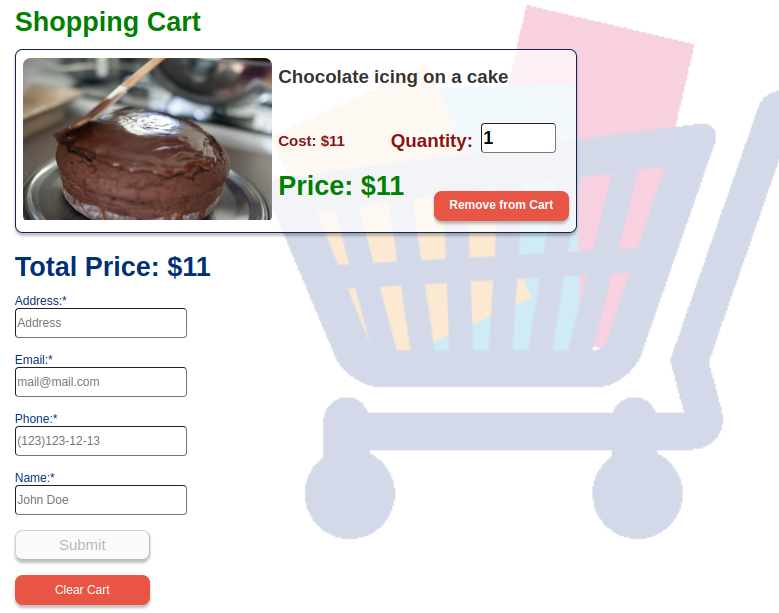
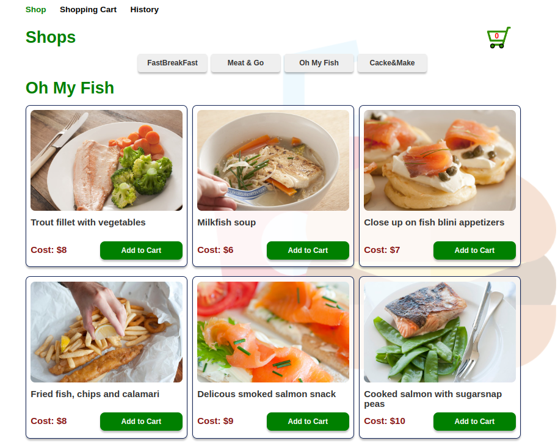
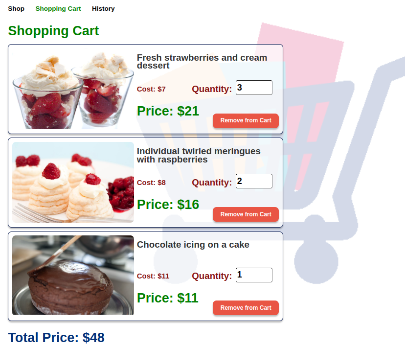
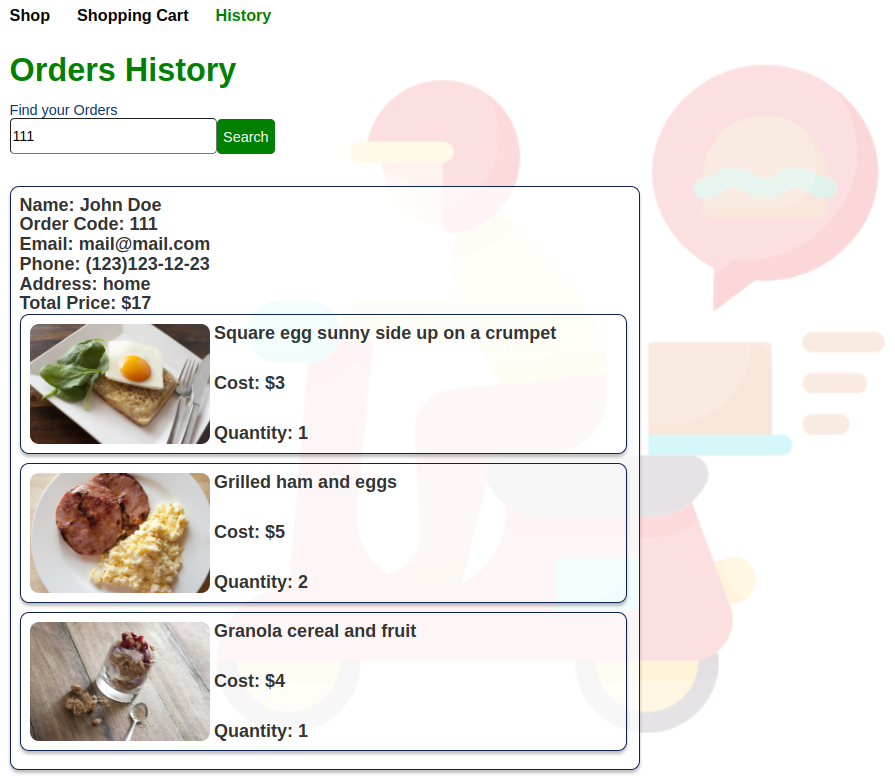

# Delivery Application

This is a simple shopping cart application built with React. It allows users choose a store, to add items to their cart, view the cart contents, update the quantity of items, and place an order by providing their contact and address information.

The application is designed to be responsive and can be accessed on **mobile phones**, **tablets**, and **desktop** devices.



## Features:

- **Add to Cart:** Users can browse through the available products and add them to their cart (_user can order goods from only one store_)
- **Cart Page:** Users can view the items in their cart, update the quantity of items, and remove items from the cart.
- **Order Submission:** Users can provide their contact information (name, email, phone) and address to place an order. The order is then submitted to the order history. The contact information undergoes validation to ensure its correctness.
- **Order History:** Users can view their order history, including order details and item information.

## Screenshots:

1. **Home Page**
   

2. **Cart Page**
   

3. **Order History Page**
   

## Database Structure:

The application uses [**Mockapi.io**](https://mockapi.io/) as a database, to store and manage the necessary data. The following describes the structure of the database and the types of data stored:

#### Products:

```json
[
 {
  "image": "https://freefoodphotos.com/imagelibrary/breakfast/slides/helathy_breakfast.jpg",
  "goods": "Square egg sunny side up on a crumpet",
  "shop": "FastBreakFast",
  "cost": 3,
  "quantity": 1,
  "id": "1"
 },
 ......
]
```

#### Orders:

```json
[
......
 {
  "name": "John Doe",
  "phone": "0123456789",
  "email": "mail@mail.com",
  "address": "Home",
  "goods": [
   {
    "image": "https://freefoodphotos.com/imagelibrary/breakfast/slides/helathy_breakfast.jpg",
    "goods": "Square egg sunny side up on a crumpet",
    "shop": "FastBreakFast",
    "cost": 3,
    "quantity": 1,
    "id": "1"
   },
   {
    "image": "https://freefoodphotos.com/imagelibrary/breakfast/slides/ham_eggs.jpg",
    "goods": "Grilled ham and eggs",
    "shop": "FastBreakFast",
    "cost": 5,
    "quantity": 1,
    "id": "2"
   }
  ],
  "totalPrice": 8,
  "orderCode": "MEDe",
  "id": "22"
 },
 ......
]
```

## Installation:

1. **Clone the repository:**

   ```bash
   git clone https://github.com/Gena-Tin/delivery-app.git
   ```

2. **Navigate to the project directory:**

   ```bash
   cd delivery-app
   ```

3. **Install the dependencies:**
   ```bash
   npm install
   ```

## Usage:

1. **Start the development server:**

   ```bash
   npm start
   ```

2. **Open the application in your browser:**

   ```python
   http://localhost:3000
   ```

3. Or make your life easier and just go to the live page: [Delivery App](https://delivery-app-gt.netlify.app/)

## Technologies Used

- React
- React Router
- HTML
- CSS
- JavaScript
- Mockapi

## Project tree

```
│
└─ src
   ├─ App.js
   ├─ api
   ├─ components
   │  ├─ CartItem
   │  ├─ Footer
   │  ├─ Header
   │  ├─ Loader
   │  ├─ NotFoundRedirect
   │  ├─ OrderCard
   │  └─ ProductCard
   └─ pages
      ├─ CartPage
      ├─ OrderHistoryPage
      └─ ShopPage

```

## Contributing:

Contributions are welcome! If you find any issues or have suggestions for improvements, please open an issue or submit a pull request.

## Acknowledgements:

- The shopping cart icon used in the application is from [**Iconfinder**](https://www.iconfinder.com/).
- The product images used in the application are for demonstration purposes only and belong to their respective owners.
