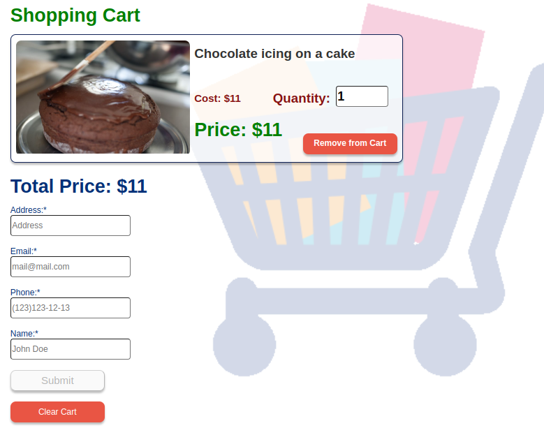
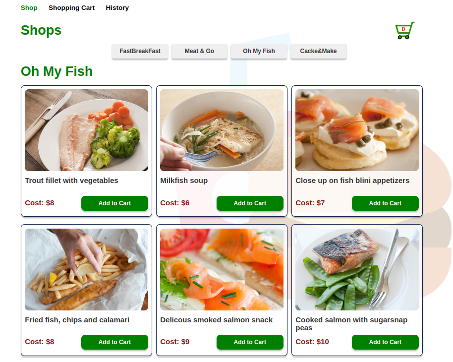
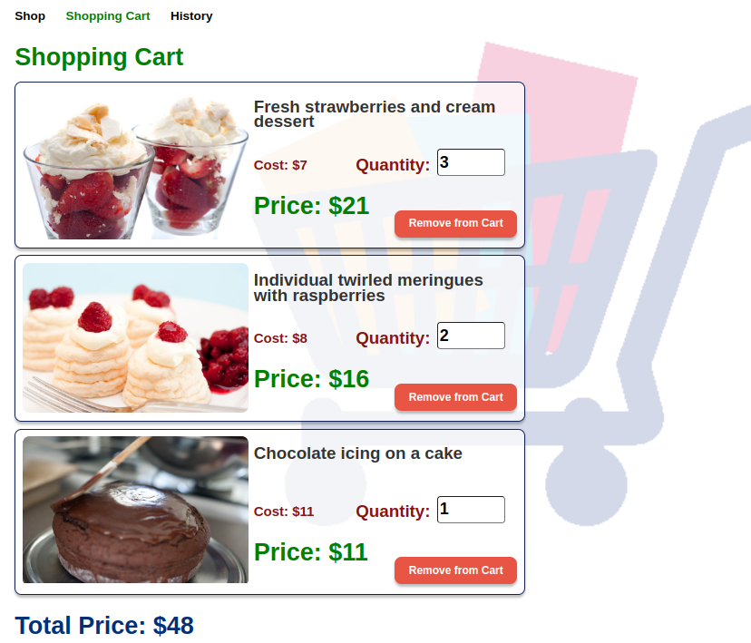
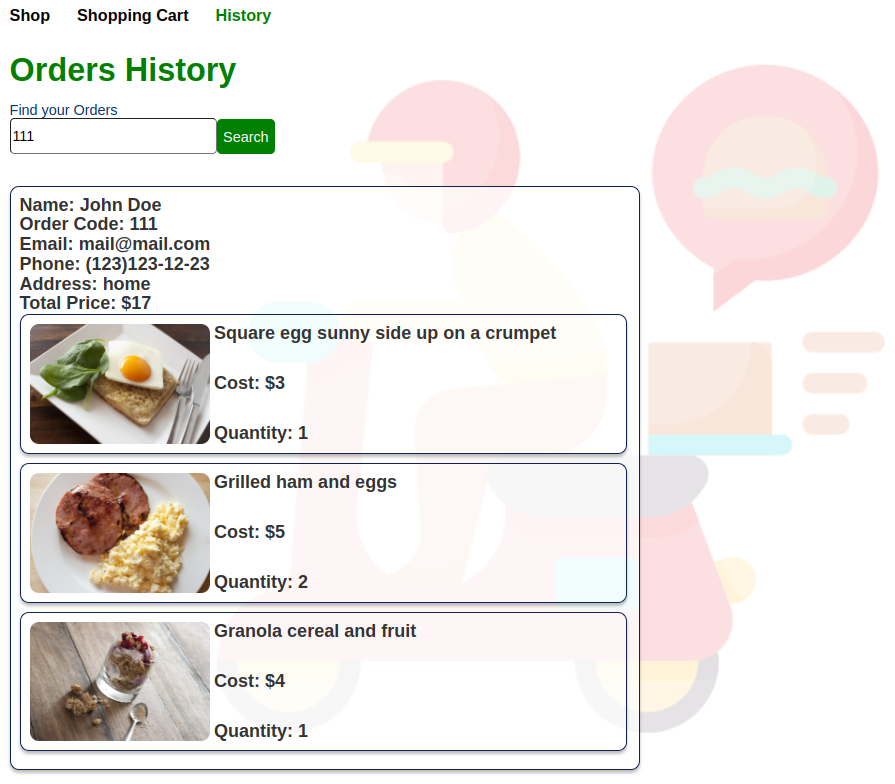

# Delivery Application

This is a modern fullstack shopping cart and delivery application built with React, Node.js (Express), TypeScript, and PostgreSQL. It allows users to choose a store, add items to their cart, view cart contents, update item quantities, and place an order.

A key feature of the application is the ability for users to specify their exact delivery location on an interactive map (perfect for ordering while outdoors).

The application is designed to be fully responsive and optimized for **mobile phones**, **tablets**, and **desktop** devices.



## Features:

- **Add to Cart:** Browse through available products and add them to the cart (_users can order goods from only one store at a time_).
- **Cart Page:** View items, dynamically update quantities, and remove items.
- **Order Submission with Geolocation:** Place an order by providing contact information (name, email, phone) and optionally **pinning your delivery location on the map** (ideal for immediate, on-the-street delivery using precise coordinates).
- **Order History:** View past orders, including item breakdowns, costs, and exact delivery locations.

## Screenshots:

1. **Home Page**
   

2. **Cart Page**
   

3. **Order History Page**
   

## Database Structure:

#### Database Schema:

```sql
CREATE SCHEMA IF NOT EXISTS shop;

-- Stores
CREATE TABLE shop.shops (
    id SERIAL PRIMARY KEY,
    name VARCHAR(255) NOT NULL UNIQUE,
    image TEXT,
    details JSONB DEFAULT '{}'::jsonb
);

-- Goods
CREATE TABLE shop.goods (
    id SERIAL PRIMARY KEY,
    shop_id INTEGER REFERENCES shop.shops(id) ON DELETE CASCADE,
    title VARCHAR(255) NOT NULL,
    image TEXT,
    cost NUMERIC(10, 2) NOT NULL,
    attributes JSONB DEFAULT '{}'::jsonb
);

-- Orders (NoSQL hybrid via JSONB)
CREATE TABLE shop.orders (
    id SERIAL PRIMARY KEY,
    order_code VARCHAR(50) UNIQUE NOT NULL,
    status VARCHAR(50) DEFAULT 'pending',
    created_at TIMESTAMP DEFAULT CURRENT_TIMESTAMP,
    order_data JSONB NOT NULL -- Customer info, item snapshots, and delivery coordinates
);
```

#### Order JSONB Document Structure (with GeoJSON support):

```json
{
  "customer": {
    "name": "John Doe",
    "phone": "0970000000",
    "email": "fester@addams.com",
    "address": "Delivery to coordinates"
  },
  "goods": [
    {
      "title": "Trout fillet with vegetables",
      "cost": 8.0,
      "quantity": 1
    }
  ],
  "totalPrice": 8.0,
  "delivery_location": {
    "type": "Point",
    "coordinates": [43.002488, 34.080701] // [Longitude, Latitude]
  }
}
```

## Technologies Used

### Frontend:

- React.js
- React Router
- CSS (Responsive Layouts)

### Backend & Database:

- Node.js & Express
- TypeScript
- PostgreSQL (via Neon Serverless)
- pg (node-postgres driver)

## Installation & Setup

### 1. **Clone the repository:**

```bash
git clone [https://github.com/Gena-Tin/delivery-app.git](https://github.com/Gena-Tin/delivery-app.git)
cd delivery-app
```

### 2. **Backend Setup:**

- Navigate to the server folder:

  ```bash
  cd server
  ```

- Install the dependencies:

  ```bash
  npm install
  ```

- Rename `.env.example` to `.env` Configure your .env file in the `server` root and add your database and port configurations

  ```code
  PORT=4000
  DATABASE_URL=your_neon_postgresql_connection_string
  ```

- Start the development server (runs on http://localhost:4000):

  ```bash
  npm run dev
  ```

### 3. **Frontend Setup:**

- Navigate to the client/frontend directory:

  ```bash
  cd ../client
  ```

- Install dependencies and run:

  ```bash
  npm install
  npm start
  ```

- Open the app at http://localhost:3000

### 4. Or make your life easier and just go to the live page: [Delivery App](https://delivery-app-gt.netlify.app/)

## Project tree:

```
│
├── client/                    # Frontend React Application
│   ├── public/
│   └─ src
│      ├─ App.js
│      ├─ api
│      ├─ components           # Reusable UI Components
│      │  ├─ CartItem
│      │  ├─ Footer
│      │  ├─ Header
│      │  ├─ Loader
│      │  ├─ NotFoundRedirect
│      │  ├─ OrderCard
│      │  └─ ProductCard
│      └─ pages                # Application Pages
│         ├─ CartPage
│         ├─ OrderHistoryPage
│         └─ ShopPage
└── server/                    # Backend Express & TypeScript Application
    ├── src/
    │   ├── config/            # Database Pool Configuration
    │   ├── routes/            # API Routes (Shops, Goods, Orders)
    │   └── index.ts           # Server Entrypoint
    ├── tsconfig.json
    └── package.json
```

## Contributing:

Contributions are welcome! If you find any issues or have suggestions for improvements, please open an issue or submit a pull request.

## Acknowledgements:

- The shopping cart icon used in the application is from [**Iconfinder**](https://www.iconfinder.com/).
- The product images used in the application are for demonstration purposes only and belong to their respective owners (courtesy of FreeFoodPhotos).
